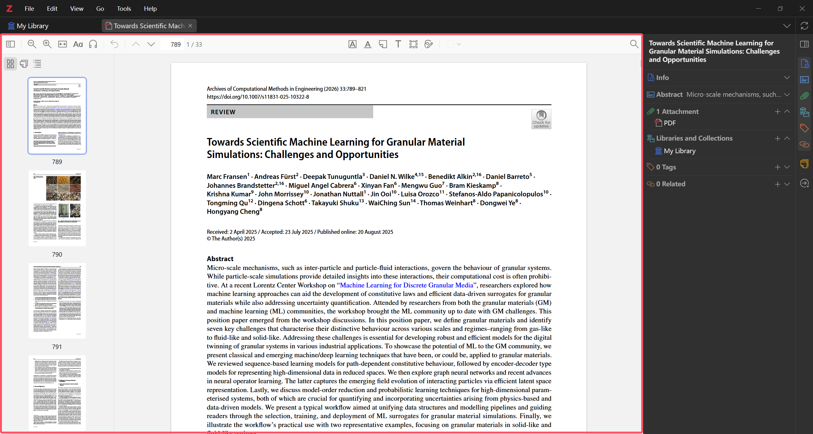
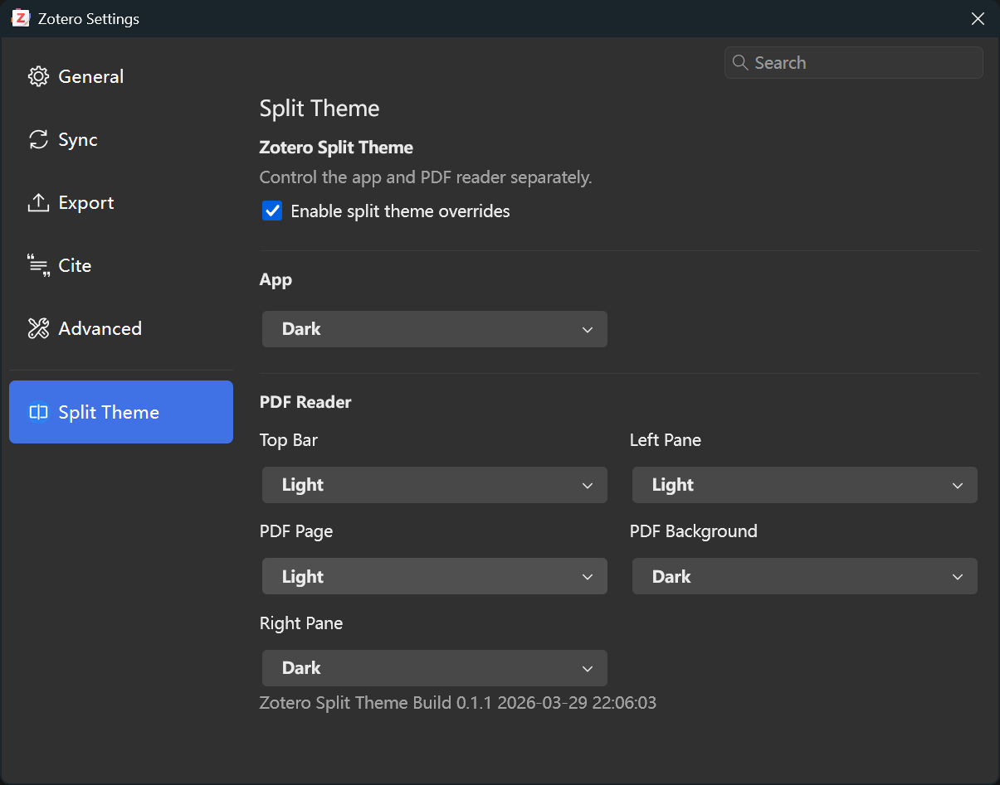

# Zotero Split Theme

[](https://www.zotero.org/) [](https://github.com/Diraw/zotero-split-theme/releases) [](https://github.com/Diraw/zotero-split-theme/releases/) [](https://github.com/windingwind/zotero-plugin-template)

<p align="right"><b>English</b> | <a href="README.zh-CN.md">中文</a></p>

**This plugin is built for the common mixed-theme workflow that Zotero does not provide out of the box**, such as:

- dark Zotero interface + light PDF reading area
- dark Zotero interface + light PDF reader + dark metadata sidebar
- different themes for PDF toolbar, left sidebar, reading area, and right sidebar

## Preview





## Features

- Independent theme control for the main Zotero interface
- Independent theme control for PDF reader zones:
  - top toolbar
  - left collapsible sidebar
  - reading area
  - right info sidebar

## Installation

1. Go to the [Releases](https://github.com/Diraw/zotero-split-theme/releases) page.
2. Download the latest `zotero-split-theme.xpi`.
3. In Zotero, open `Tools -> Plugins`.
4. Drag the `.xpi` file into the Plugins window and install it.
5. Restart Zotero if prompted.

## Usage

After installation, open:

`Edit -> Settings -> Zotero Split Theme`

Available settings:

- `Main Interface`
- `PDF Reader -> Top Bar`
- `PDF Reader -> Left Pane`
- `PDF Reader -> Reading Area`
- `PDF Reader -> Right Pane`

Each area can be set to:

- `Follow Zotero`
- `Light`
- `Dark`

## Development

Requirements:

- Zotero 8 beta
- Node.js LTS

Commands:

```powershell
npm install
npm start
npm run build
```

Build output:

- `.scaffold/build/zotero-split-theme.xpi`
- `.scaffold/build/update.json`

## Release

This repository is configured to publish releases through GitHub Actions.

Recommended release flow:

```powershell
npm run build
npm run lint:check
```

1. Update the version in `package.json` (for example, `0.1.1` -> `0.1.2`).
2. Run the local checks:

```powershell
npm run build
npm run lint:check
```

3. Commit the release changes:

```powershell
git add .
git commit -m "release: v0.1.2"
```

4. Create and push the release tag:

```powershell
git tag v0.1.2
git push origin main
git push origin v0.1.2
```

Pushing a `v*` tag triggers the workflow in [.github/workflows/release.yml](./.github/workflows/release.yml), which runs `npm run build` and `npm run release`, then publishes the release assets automatically.

## License

[AGPL-3.0-or-later](./LICENSE)
