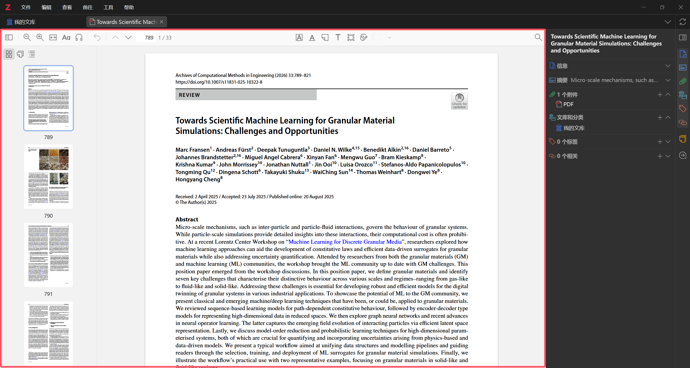
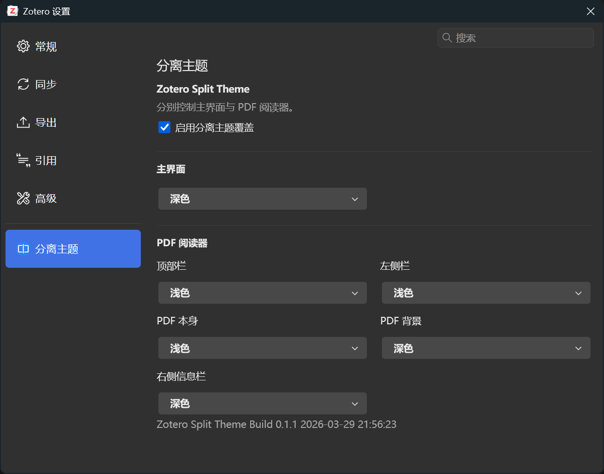

# Zotero Split Theme

[](https://www.zotero.org/) [](https://github.com/Diraw/zotero-split-theme/releases) [](https://github.com/Diraw/zotero-split-theme/releases/) [](https://github.com/windingwind/zotero-plugin-template)

<p align="right"><a href="README.md">English</a> | <b>中文</b></p>

**这个插件主要解决 Zotero 原生不能灵活混合主题的问题**，比如：

- Zotero 主界面深色，PDF 阅读区浅色
- Zotero 主界面深色，PDF 阅读区浅色，右侧信息栏深色
- PDF 顶部栏、左侧栏、阅读区、右侧栏分别使用不同主题

## 效果预览





## 功能

- 主界面主题独立控制
- PDF 阅读器四个区域独立控制：
  - 顶部栏
  - 左侧折叠栏
  - 阅读区
  - 右侧信息栏

## 安装

1. 打开 [Releases](https://github.com/Diraw/zotero-split-theme/releases) 页面。
2. 下载最新的 `zotero-split-theme.xpi`。
3. 在 Zotero 中打开 `工具 -> 插件`。
4. 把 `.xpi` 文件拖进插件窗口安装。
5. 如果 Zotero 提示重启，就重启一次。

## 使用

安装后，打开：

`编辑 -> 设置 -> 分离主题`

可以分别设置：

- `主界面`
- `PDF 阅读器 -> 顶部栏`
- `PDF 阅读器 -> 左侧栏`
- `PDF 阅读器 -> 阅读区`
- `PDF 阅读器 -> 右侧栏`

每个区域都支持：

- `跟随 Zotero`
- `浅色`
- `深色`

## 开发

环境要求：

- Zotero 8 beta
- Node.js LTS

常用命令：

```powershell
npm install
npm start
npm run build
```

构建产物：

- `.scaffold/build/zotero-split-theme.xpi`
- `.scaffold/build/update.json`

## 发布

这个仓库已经配置了 GitHub Actions 自动发布。

推荐发布流程：

```powershell
npm run build
npm run lint:check
```

1. 先更新 `package.json` 里的版本号，例如 `0.1.1` -> `0.1.2`。
2. 本地执行检查：

```powershell
npm run build
npm run lint:check
```

3. 提交发版修改：

```powershell
git add .
git commit -m "release: v0.1.2"
```

4. 创建并推送版本 tag：

```powershell
git tag v0.1.2
git push origin main
git push origin v0.1.2
```

推送 `v*` tag 后，会触发 [.github/workflows/release.yml](./.github/workflows/release.yml)，执行 `npm run build` 和 `npm run release`，并自动创建 Release、上传构建产物。

## 许可证

[AGPL-3.0-or-later](./LICENSE)
